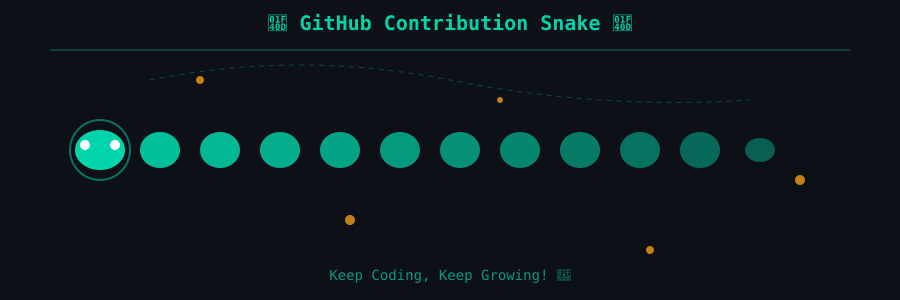

# 👋 你好，我是 WolfMoss

一个热爱开源的开发者，专注于通过技术创新解决实际问题。

[📚 热门项目](#-明星项目) · [🤖 AI 自动化](#-ai--自动化) · [💻 技术栈](#-技术栈) · [📫 联系我](#-联系我)

---

## 📊 GitHub 统计

---

## 🔥 明星项目

| 项目 | 描述 | 语言 | Stars |
|------|------|------|-------|
|  | Python 爬虫逆向项目合集，每个文件夹都是成品项目 | JavaScript | ⭐ 31 |
|  | 为知笔记 Vditor 编辑器集成 | HTML | ⭐ 13 |
|  | PHP 调用阿里云 API 实现 DDNS 动态域名解析 | PHP | ⭐ 2 |

---

## 🤖 AI & 自动化

> 专注于 AI 工具开发和自动化脚本

| 项目 | 描述 |
|------|------|
| [AI-Maintained-Repository](https://github.com/WolfMoss/AI-Maintained-Repository) | 🤖 由 AI 自主维护和更新的仓库 - AI 自动优化代码、文档和功能 |
| [iflow-agent](https://github.com/WolfMoss/iflow-agent) | Python Agent 框架 |
| [dow-ipad-859](https://github.com/WolfMoss/dow-ipad-859) | 基于 859 版 iPad 协议的微信机器人，集成 dify-on-wechat |
| [pyWeChatPadProBot](https://github.com/WolfMoss/pyWeChatPadProBot) | 微信 PadPro 机器人 |
| [wechatbot-webhook](https://github.com/WolfMoss/wechatbot-webhook) | 微信机器人 HTTP Webhook 服务 |
| [AutoTradeAndLevel2](https://github.com/WolfMoss/AutoTradeAndLevel2) | C# 量化交易与 Level2 数据分析 |
| [py-qqbot](https://github.com/WolfMoss/py-qqbot) | Python QQ 机器人 |
| [pyFeishuSdk](https://github.com/WolfMoss/pyFeishuSdk) | 飞书 SDK Python 包 |

---

## 🛠️ 工具 & 实用程序

| 项目 | 描述 |
|------|------|
| [better-games-impact](https://github.com/WolfMoss/better-games-impact) | 基于 better-genshin-impact 的通用游戏自动化项目 |
| [wolfmoss_skills](https://github.com/WolfMoss/wolfmoss_skills) | 自用 Claude Code Skills 配置 |
| [qq-bot](https://github.com/WolfMoss/qq-bot) | QQ Bot based on qq-botpy SDK |
| [PHP-ALIBABA-DDNS](https://github.com/WolfMoss/PHP-ALIBABA-DDNS) | PHP 调用阿里云 API 实现 DDNS 动态域名解析 |
| [WindowsShutDown](https://github.com/WolfMoss/WindowsShutDown) | 远程关机工具 |
| [SetIP](https://github.com/WolfMoss/SetIP) | Windows IP 配置工具 |
| [game2048](https://github.com/WolfMoss/game2048) | C# 版 2048 游戏 |

---

## 💻 技术栈

<table align="center">
<tr>
<td align="center">
<b>后端开发</b> 
Python · PHP · Node.js
</td>
<td align="center">
<b>前端技术</b> 
JavaScript · HTML5 · CSS3
</td>
<td align="center">
<b>AI/ML</b> 
AI Agent · 自动化 · 量化交易
</td>
<td align="center">
<b>开发工具</b> 
Git · Docker · CLI
</td>
</tr>
</table>

---

## 🏆 开源贡献

### ✨ 已关闭的 Issues

| 项目 | 描述 | 时间 |
|------|------|------|
| [MiniMax-AI/Mini-Agent#61](https://github.com/MiniMax-AI/Mini-Agent/issues/61) | ✨ 增加非交互模式 | 2026-02-11 |
| [Vanessa219/vditor#1070](https://github.com/Vanessa219/vditor/issues/1070) | 如何默认全屏？ | 2021-08-23 |
| [WolfMoss/Wiz.Vditor#2](https://github.com/WolfMoss/Wiz.Vditor/issues/2) | 支持默认上传图片到为知 | 2021-02-08 |
| [liukuo362573/YiShaAdmin#29](https://github.com/liukuo362573/YiShaAdmin/issues/29) | mysql_data.sql 语句错误 | 2020-05-22 |

### 📝 开放的 Issues

| 项目 | 描述 | 时间 |
|------|------|------|
| [Estrella-Explore/YangJY-AcadMisconduct#7](https://github.com/Estrella-Explore/YangJY-AcadMisconduct/issues/7) | 部署 Discuz! | 2025-08-04 |
| [suqingdong/sparkapi#7](https://github.com/suqingdong/sparkapi/issues/7) | 定义最大 token 数不起作用 | 2024-03-12 |
| [firerpa/lamda#73](https://github.com/firerpa/lamda/issues/73) | 雷电模拟器 CRITICAL failed | 2024-01-19 |

---

## 📫 联系我

---

*Keep Coding, Keep Growing! 🚀*

